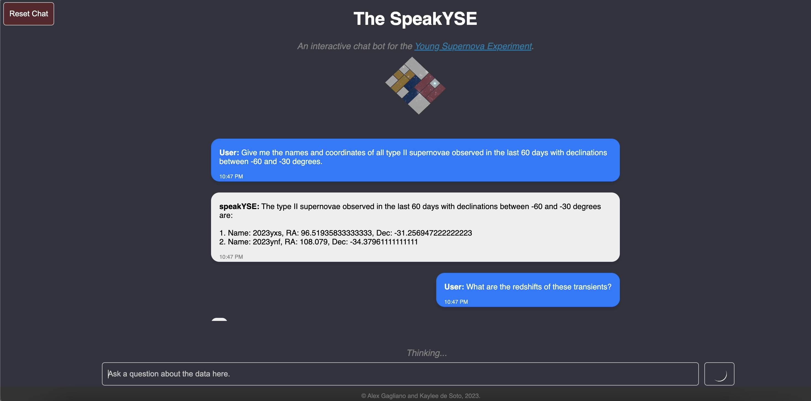

# The SpeakYSE
A LLM-based model fine-tuned for answering questions about supernovae and other transients.

This repository has been archived and will no longer be maintained. An open-source version of the SpeakYSE is coming soon -- stay tuned!
